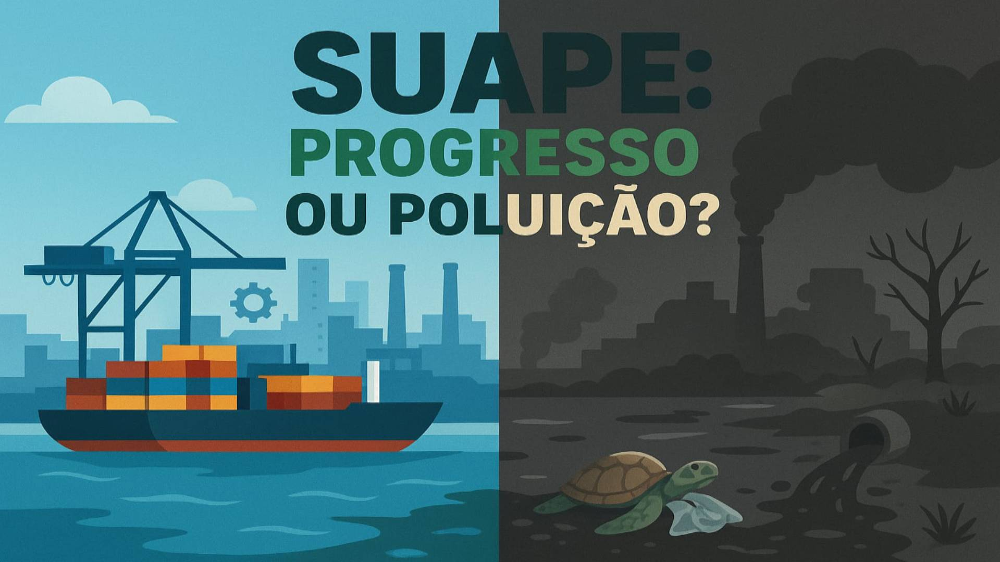

# Suape: Progresso ou Poluição?

## Trabalho de Conclusão de Pesquisa do Ensino Médio - Colégio Imaculada da Conceição



### 🧐 Sobre o Projeto
Este projeto é o Trabalho de Conclusão de Pesquisa do Ensino Médio, com o tema **"Suape: Progresso ou Poluição?"**. O objetivo é realizar uma análise crítica e científica sobre o Complexo Industrial Portuário de Suape, em Pernambuco, investigando seus impactos socioambientais.

O site foi desenvolvido para apresentar os resultados da pesquisa de forma visual e interativa, com gráficos e dados acessíveis. Nosso propósito é conscientizar o público sobre o delicado equilíbrio entre o desenvolvimento econômico e a sustentabilidade ambiental na região.

### ✨ Funcionalidades
* **Análise de Dados Interativa**: Apresentação de dados da pesquisa por meio de gráficos dinâmicos e visuais, criados com a biblioteca Chart.js.
* **Estrutura Científica**: Seções dedicadas à **metodologia**, **referencial teórico**, **resultados** e **dados brutos**, proporcionando uma visão completa do rigor científico da pesquisa.
* **Design Profissional e Intuitivo**: Interface limpa e moderna, desenvolvida com princípios de **UI/UX** para garantir uma navegação fluida e agradável.
* **Conteúdo Educacional**: Além dos dados, o site oferece um **blog** com artigos, um **glossário** de termos técnicos e uma área para **publicações** da equipe.
* **Funcionalidade de Autenticação**: Páginas de **Login** e **Cadastro** para acesso a conteúdos exclusivos e recursos adicionais do projeto.

---

### 💻 Tecnologias
O projeto foi construído utilizando um conjunto de tecnologias voltadas para o desenvolvimento web:

* **HTML5**: Para a estrutura semântica do conteúdo.
* **CSS3**: Para a estilização e responsividade da interface.
* **JavaScript**: Para a interatividade do site, incluindo animações e a lógica do modo claro/escuro.
* **Bootstrap 5.3**: Framework CSS para agilizar o desenvolvimento e garantir a responsividade em diferentes dispositivos.
* **AOS (Animate on Scroll)**: Biblioteca para animações de rolagem, adicionando um toque profissional à experiência.
* **Chart.js**: Biblioteca essencial para a criação e visualização de gráficos interativos.
* **Google Fonts**: Para a tipografia, utilizando as fontes `Montserrat` e `Open Sans`.
* **Font Awesome**: Para os ícones, como os de download e visualização.

---

### 🚀 Como Acessar o Projeto
Você não precisa instalar nada! Para visualizar o site, basta seguir estes passos:

1.  Baixe ou clone este repositório.
2.  Abra o arquivo `index.html` em qualquer navegador web moderno (como Chrome, Firefox ou Edge).

Você pode usar o comando abaixo no terminal para abri-lo rapidamente (no macOS):

```bash
open index.html
